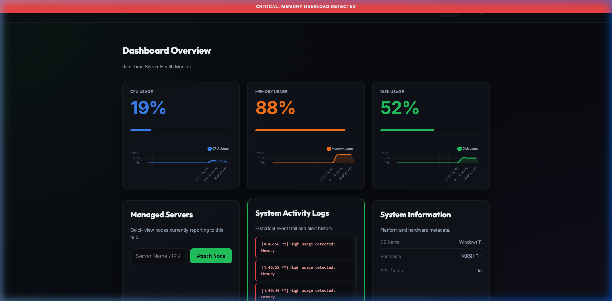
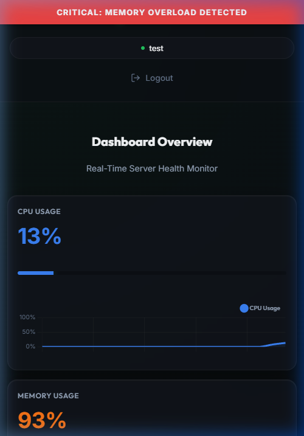
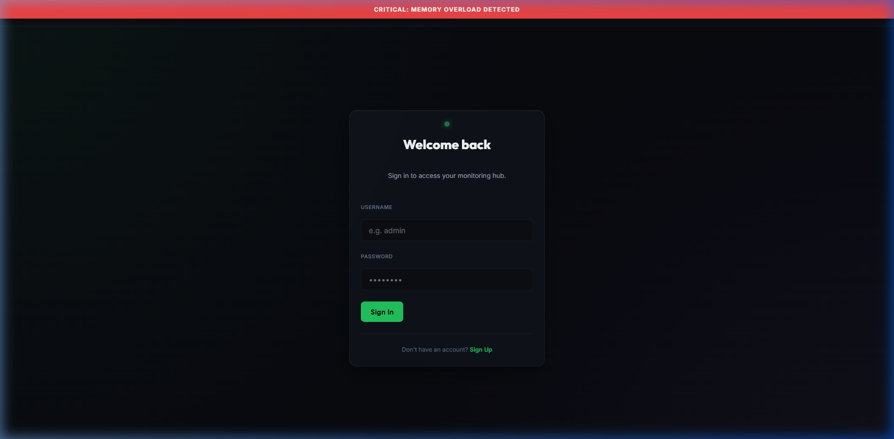
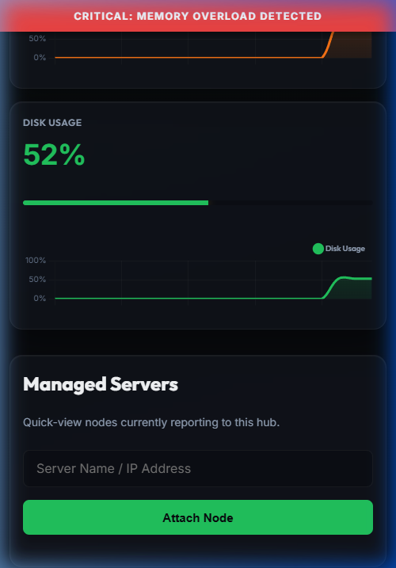

# Opsentinel: Standardized DevOps Monitoring Hub 🛰️

[](https://opensource.org/licenses/MIT)
[](https://harshithcheripally16-ui.github.io/opsentinel/)

**Opsentinel** is a professional-grade, mission-critical DevOps monitoring suite designed for high-reliability telemetry. Built with a focus on stability and observability, it provides a purely breathable, information-dense "Mission Control" hub for real-time server health.

---

## 📸 Project Showcase

### High-Fidelity Dashboard (Desktop & Mobile)

| Desktop Infrastructure Hub | Mobile Control Center |
| :---: | :---: |
|  |  |

### Premium Authentication Gateway

| Login Interface | Node Management (Mobile) |
| :---: | :---: |
|  |  |

---

## 🌐 Live Demo

> [!TIP]
> **Experience Opsentinel instantly!** 
> 🚀 [Explore the Live Standalone Demo](https://harshithcheripally16-ui.github.io/opsentinel/)

*Note: The standalone preview leverages the refined "Atomic Hydration" engine and standardized spacing system, hosted via GitHub Pages for demonstration.*

---

## ⚡ Mission-Critical Features

- **Standardized Spacing System**: A premium, breathable SaaS aesthetic powered by a global CSS variable scale for perfect visual rhythm.
- **Atomic DOM Safety & Tracing**: Zero-crash hydration architecture utilizing strict existence guards and real-time `[Opsentinel Trace]` observability.
- **Responsive Resilience**: Touch-optimized layout architectures with vertical tool-stacking for seamless mobile monitoring.
- **Intelligent Alerting**: Dynamic, high-contrast overload banners with centralized log auditing for usage spikes.
- **Secure Authentication**: Modular session management with industrial-grade password hashing and atomic hydration.
- **Docker-Ready Orchestration**: Built-in Docker and Docker-Compose support for standardized, containerized deployments.

---

## 🚀 Ignition & Local Setup

### 1. Prerequisites
- **Python 3.10+**
- **pip** (Python package manager)

### 2. Local Launch
```bash
# Clone the orchestration hub
git clone https://github.com/yourusername/Opsentinel.git
cd Opsentinel

# Install telemetry dependencies
pip install -r requirements.txt

# Ignite the platform
python run.py
```

---

## 🐳 Containerized Deployment

For high-availability, production-ready environments:

```bash
# Orchestrate via Docker Compose
docker-compose up --build -d
```

---

## 🔑 Default Credentials

To get started immediately after installation:
- **Username**: `admin`
- **Password**: `admin`

---

## 🛠️ Orchestration Structure

```text
app/          # Mission-Critical Python Logic (Auth, Telemetry, DB)
docs/         # Standalone Demo & High-Resolution Assets
static/       # Global Design System (CSS) & Monitoring Engine (JS)
templates/    # Atomic UI Components & Layouts
run.py        # Canonical CLI Entry Point
Dockerfile    # Standardized Container Def
```

---

## License

Opsentinel is released under the [MIT License](LICENSE).
