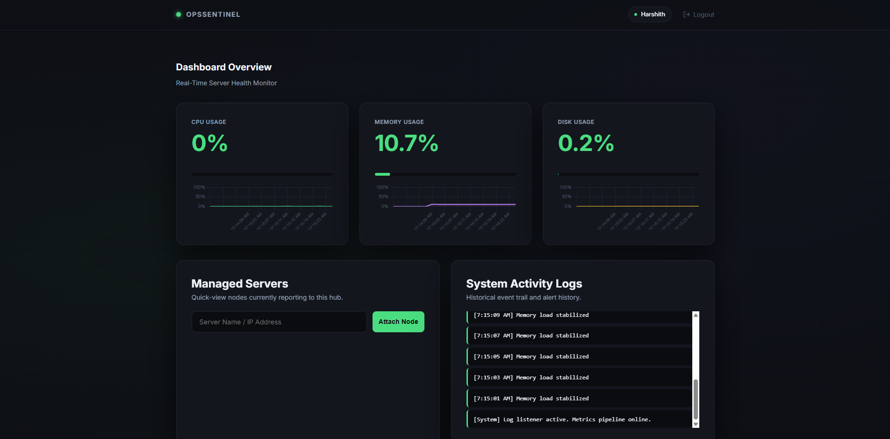

# Opsentinel: Standardized DevOps Monitoring

[](https://opensource.org/licenses/MIT)
[](https://harshithcheripally16-ui.github.io/opsentinel/)

**Opsentinel** is a professional-grade DevOps monitoring tool designed to provide real-time telemetry into server health. Built with Flask, vanilla JavaScript, and Chart.js, it offers a single-pane-of-glass overview of your infrastructure's critical resource usage.

---

## 📸 Preview


*High-fidelity monitoring cards displaying real-time CPU, Memory, and Disk metrics.*

---

## 🌐 Live Demo

> [!TIP]
> **Experience Opsentinel instantly!** 
> 🚀 [Launch the Live Dashboard](https://harshithcheripally16-ui.github.io/opsentinel/)

*Note: The static preview uses simulated data and is hosted via GitHub Pages for demonstration.*

---

## ⚡ Features

- **Real-Time Metrics**: Instant monitoring of CPU, RAM, and Disk using the `psutil` engine.
- **Visual Analytics (Charts)**: Visual performance tracking over time powered by Chart.js.
- **Responsive Design**: Full mobile and tablet support with fluid layouts and touch-optimized controls.
- **Intelligent Alerting**: Dynamic alert banners and historical logging of usage spikes above 80%.
- **Secure Authentication**: Modular session management with industrial-grade password hashing.
- **Docker Support**: Built for the container age with full Docker and Docker-Compose compatibility.
- **Clean Architecture**: Modular layout with a dedicated API layer and shared utility helpers.

---

## 🚀 How to Run Locally

Get up and running in your local development environment in seconds.

### 1. Prerequisites
- **Python 3.10+**
- **pip** (Python package manager)

### 2. Setup
```bash
# Clone the repository
git clone https://github.com/yourusername/Opsentinel.git
cd Opsentinel

# Install requirements
pip install -r requirements.txt

# Launch the platform
python run.py
```

---

## 🐳 Docker Usage

For isolated, production-ready deployments, we recommend using Docker.

### Using Docker Compose (Quickest)
```bash
docker-compose up --build -d
```

### Manual Docker Build
```bash
docker build -t opsentinel .
docker run -p 5000:5000 opsentinel
```

---

## 🔑 Default Credentials

To get started immediately after installation:
- **Username**: `admin`
- **Password**: `admin`

---

## 🛠️ Project Structure

```text
app/          # Core Python Logic (Auth, Routes, DB, Utils)
docs/         # Static Frontend Demo (GitHub Pages Hosting)
static/       # CSS & JavaScript Assets
templates/    # Jinja2 Layouts & UI Components
run.py        # Canonical CLI Entry Point
Dockerfile    # Standardized Container Image Def
```

---

## License

Opsentinel is released under the [MIT License](LICENSE).
